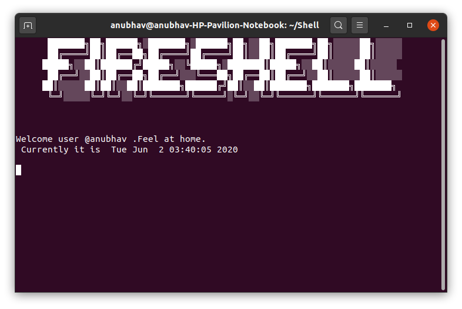

#### FIRESHELL
A UNIX SHELL 

A unix shell that supports already exisitng commands, piping and various newly added commands and functionalities.
It is developed in C language.


## **To use :-**

* Install C compiler and libraries

* Install lreadline library :-
 
 ```
 sudo apt-get install libreadline6 libreadline6-dev
```
